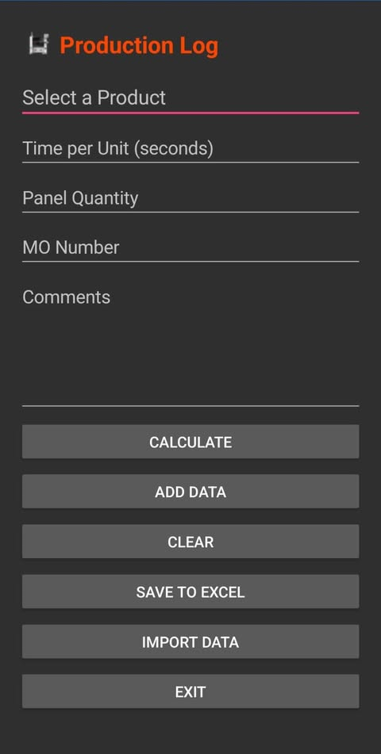

# 📝 **ProdLogProg**

[](https://github.com/antzsmt/ProdLogProg/issues)
[](https://github.com/antzsmt/ProdLogProg/network)
[](https://github.com/antzsmt/ProdLogProg/stargazers)


---

## 🌟 **Production Log App for Android**
ProdLogProg is an innovative and easy-to-use Android application designed for production logging. Whether you're keeping track of workflows, monitoring production processes, or logging essential data, this app simplifies your efforts and enhances productivity.

---

## **📌 Features**

- **Streamlined Production Logging**: Record and manage production-related information effortlessly.
- **User-Friendly Interface**: Designed with simplicity and usability in mind.
- **Written in C#**: Powered by the versatility of C# programming.
- **Cross-Platform Compatibility**: Although primarily for Android, it might integrate well with other environments (if applicable).

---

## 🛠 **Getting Started**

1. **Clone the Repository**:
   ```bash
   git clone https://github.com/antzsmt/ProdLogProg.git

---

   ## **Screenshot**

   

